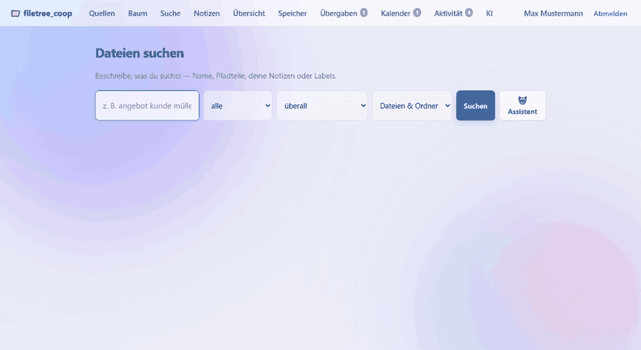
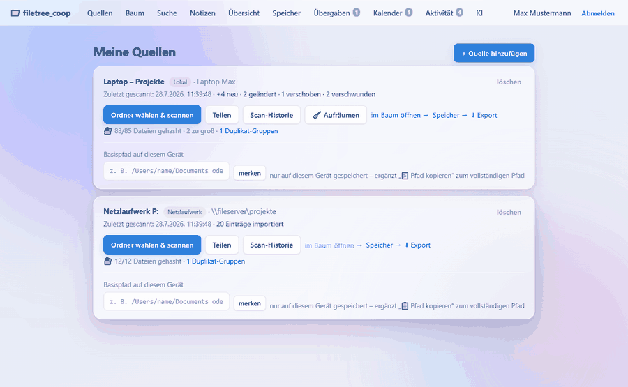
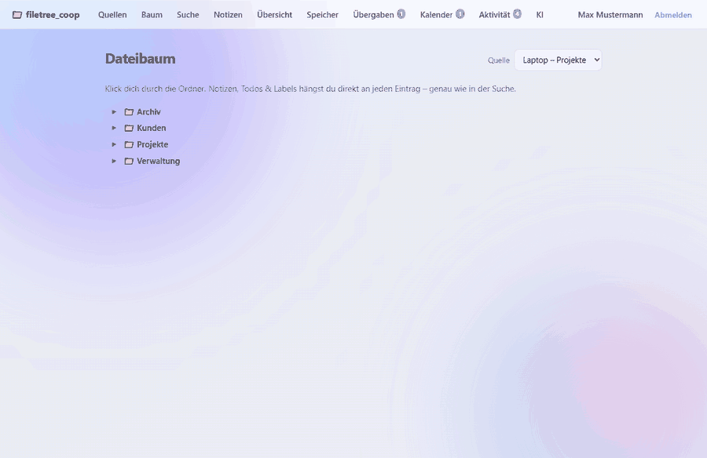
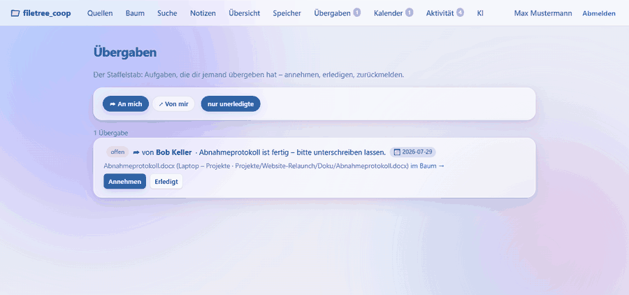
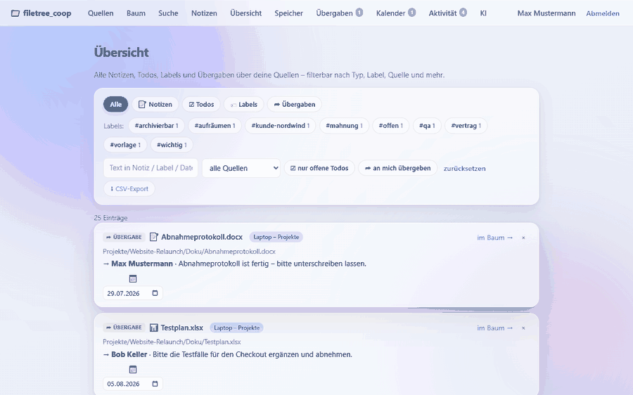
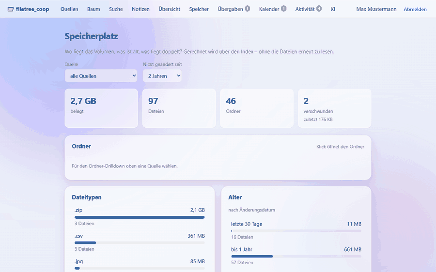
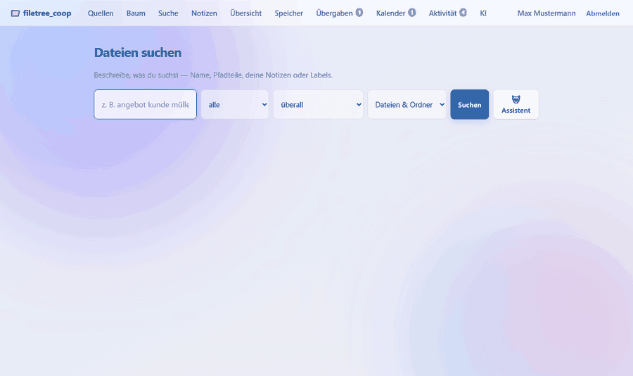
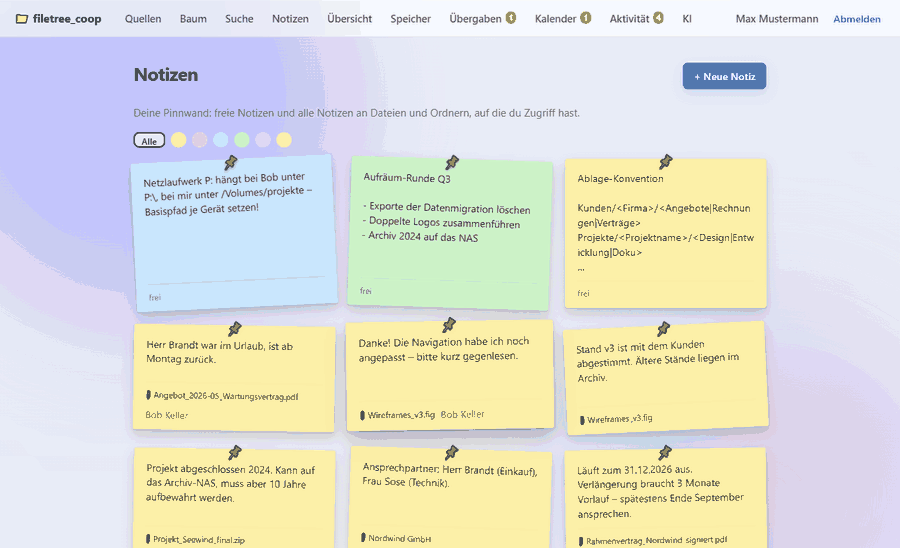

# filetree_coop

Tracke systematisch, wo Dateien liegen — über den lokale Rechner — und finde
sie per beschreibendem Suchstring statt exaktem Namen. An jede Datei lassen
sich Notizen, Todos, Labels und Übergaben an Kollegen hängen. Neuerdings
lassen sich Notizen frei erstellen und mit KI verfeinern, der Speicherplatz
auswerten (inkl. Duplikaten) und Suchanfragen in Alltagssprache stellen.

Der Clou: Der Browser selbst ist der Scanner. Über die File System Access API
wählst du einen Ordner, JavaScript läuft rekursiv durch den Baum und überträgt
nur Metadaten (Pfad, Name, Größe, Änderungsdatum) an den Server — kein
Dateiinhalt, keine Agent-Installation.

Wer es *dauerhaft* aktuell mag, installiert zusätzlich den optionalen
[**Desktop-Client**](client/README.md): ein Hintergrundprogramm im Infobereich
der Taskleiste, das die eingestellten Ordner überwacht, Änderungen von selbst
meldet — und als Einziges kann, was ein Browser prinzipbedingt nicht darf:
**den Ordner im Explorer öffnen**.



> Alle Aufnahmen in dieser README zeigen die Anwendung mit einem generierten
> Demo-Datenbestand — echte Dateien sind darin nicht enthalten.

## Schnellstart

```bash
python3 -m venv .venv
source .venv/bin/activate  # Windows: .venv\Scripts\activate
pip install -r requirements.txt
python run.py  # -> http://127.0.0.1:8000
```

Dann im Chrome oder Edge öffnen (die File System Access API gibt es nur in
Chromium-Browsern), registrieren, eine Quelle anlegen und einen Ordner scannen.

### Tests

```bash
pytest -q
```

Der [Desktop-Client](client/README.md) bringt seine eigenen mit
(`cd client && pytest`) – er ist ein eigenes Programm mit eigenen
Abhängigkeiten.

## Wie es funktioniert

1. **Registrieren/Anmelden** — Konten trennen Notizen und Übergaben.
2. **Quelle anlegen** — ein benanntes Wurzelverzeichnis („Laptop – Projekte“,
   „Netzlaufwerk P:“ …) mit Art und Ortshinweis.
3. **Scannen** — „Ordner wählen & scannen“ öffnet den Ordner-Dialog; der Browser
   erfasst alle Dateien/Ordner darunter und schickt sie in Batches an den Server.
   Der Ordner-Handle wird in IndexedDB gemerkt → **„Erneut scannen“** ohne Dialog.
   Optional danach **🔐 Inhalts-Hashes** (siehe unten).

   

4. **Finden** — auf zwei Wegen:
   - **Suche** (`/search`): Freitext über Name, Pfad, Notizen und Labels (SQLite
     FTS5, mit Präfix-Matching, z. B. findet `rech` den Ordner `Rechnungen`).
     Zwei Auswahlfelder stellen ein, **worin** gesucht wird (überall · nur
     Dateiname · Name & Pfad · nur Pfad · nur Notizen & Labels) und **was**
     gefunden werden darf (Dateien & Ordner · nur Dateien · nur Ordner) – so
     macht ein Ordner „Angebote“ nicht mehr jede Datei darunter zum Treffer.
     Dazu strukturelle Filter (Endung, Zeitraum, Größe), die auch **ohne**
     Suchtext funktionieren. Wer mag, lässt sie sich vom **🤖 Suchassistenten**
     aus einer Frage in Alltagssprache füllen.
   - **Baum** (`/browse`): durch die Ordner klicken; jede Ebene wird bei Bedarf
     nachgeladen. Über 📋 lässt sich der **Pfad kopieren** (siehe unten).
5. **Annotieren** — an jedem Treffer bzw. Baum-Eintrag Notiz/Todo/Label/Übergabe
   hinzufügen, Todos abhaken. Todos und Übergaben können ein **Fälligkeitsdatum**
   tragen (Datumsfeld im Editor, später jederzeit in der Detailliste änderbar;
   leeres Feld = kein Termin). Notizen überleben Re-Scans; verschwundene Dateien
   werden als *„verschwunden“* markiert, ohne die Notizen zu verlieren.

   

6. **Teilen & Übergeben** — per E-Mail an Kollegen freigeben (*nur lesen* oder
   *annotieren*), inklusive aller Notizen/Todos darin. Zwei Granularitäten:
   - **Ganze Quelle** — im Dashboard über „Teilen“.
   - **Nur ein Unterordner (Teilbaum)** — im **Baum** über das 🔗-Icon an jedem
     Ordner. Der Kollege sieht dann **genau diesen Ordner als Wurzel**, kann nur
     darin browsen/suchen/annotieren; alles darüber/daneben bleibt verborgen.

   Hat der Empfänger **noch kein Konto**, wird die Freigabe als **Einladung**
   gemerkt und greift automatisch, sobald er sich mit dieser E-Mail registriert.

   Eine **Übergabe** richtet sich an einen konkreten Empfänger aus dem Kreis der
   Mitglieder *dieses Pfads* – der Name wird am Eintrag angezeigt („→ Bob“).
   Übergaben haben einen **Workflow-Status** (*offen → angenommen → erledigt*):
   Unter **Übergaben** (`/handovers`) sieht jeder „An mich“ und „Von mir“,
   nimmt an, erledigt und öffnet wieder – der Empfänger darf das auch, wenn er
   sonst nur Leserechte hat. Neue Übergaben und Überfälliges erscheinen als
   **Badge in der Navigation**.

   

6b. **Diskutieren** — auf jede Annotation lässt sich per ↩ **antworten**
   (kleine Threads); jede Annotation zeigt **Autor und Datum**.
6c. **Aktivität** (`/activity`) — „Was ist passiert, seit ich weg war?“:
   Annotationen von Kollegen und Scans, zeitlich gemischt. Einträge mit neuen
   fremden Notizen tragen im Baum und in der Suche einen **blauen Punkt**, bis
   man die Quelle wieder besucht hat.
7. **Übersicht** (`/overview`) — alle Klassifizierungen quellenübergreifend an
   einem Ort: filterbar nach **Typ** (Notiz/Todo/Label/Übergabe), **Label**
   (Facetten-Chips mit Häufigkeit), **Quelle**, **Textsuche**, „**nur offene
   Todos**“ und „**an mich übergeben**“. Todos lassen sich hier direkt abhaken
   und ihr Termin direkt setzen.
8. **Kalender** (`/calendar`) — alles mit Termin in zwei Ansichten:
   - **🗓 Monat** — Monatsraster, jeder Tag zeigt seine Aufgaben; ein Klick auf
     einen Tag öffnet die vollen Einträge darunter. Heute ist markiert, Tage mit
     Überfälligem stechen rot heraus.
   - **📋 Anstehend** — nur Aufgaben *mit* Termin, streng nach Datum sortiert und
     gruppiert in *Überfällig · Heute · Morgen · Diese Woche · Diesen Monat ·
     Später*.

   Beide teilen die Filter **Quelle**, „**nur offene**“ (standardmäßig an) und
   „**an mich übergeben**“; abhaken geht direkt in beiden Ansichten.

   

**Mehrere Annotationen pro Datei** sind ausdrücklich möglich — beliebig viele
Notizen, Todos, Labels und Übergaben nebeneinander.

**⌘K / Strg+K** öffnet auf jeder Seite eine **Schnellsuch-Palette**; Enter
springt direkt in den Baum, der sich **bis zum Ziel aufklappt** (Deep-Links
`?path=…` funktionieren auch aus Übergaben und Aktivität heraus).

**Exporte:** 📆 **iCal** (`/api/export/calendar.ics`, alle offenen Termine für
Outlook/Apple/Google Calendar), ⬇ **CSV** aller Annotationen (Übersicht,
Excel-tauglich) und ⬇ **JSON** je Quelle (Dashboard, komplettes Backup samt
Annotationen).

**Voll-Backup:** ⬇ **Datenbank sichern** (Profil → Backup,
`/api/admin/backup.db`) lädt die komplette SQLite-Datei – konsistent erzeugt
über die Online-Backup-API, auch während gearbeitet wird. Weil die Datei *alle*
Nutzer samt Passwort-Hashes und LLM-Tokens enthält, darf das nur ein
Betreiber-Konto: standardmäßig das zuerst registrierte, per
`FTC_BACKUP_ADMINS` frei festlegbar. Wiederherstellen = App stoppen, Datei nach
`FTC_DB_PATH` legen, App starten.

**Bedienung (Explorer-Stil):** kompakte Zeilen; Annotationen erscheinen als kleine
**Chips** (`#label`, `📝 2`, `☑ 1/3`, `➦ Bob`, `📅 23.7.2026` für den nächsten
offenen Termin – rot, sobald er überfällig ist). Rechts in jeder Zeile erscheinen
beim Überfahren **Action-Icons** (📝 Notiz · ☑ Todo · 🏷 Label · ➦ Übergabe · ⋯
Details) – kein Typ-Dropdown mehr, ein Klick öffnet direkt den passenden
Inline-Editor. Dateien tragen **Typ-Icons** nach Endung (📕 PDF, 📊 Tabelle,
🖼️ Bild, 🎬 Video, 🐍 Python …), Ordner ein 📁.

## Pfad kopieren (📋)

Ein **Ordner im OS-Explorer/Finder zu öffnen ist aus dem Browser technisch nicht
möglich** (Sandbox) – und die File System Access API gibt den **absoluten Pfad**
einer gescannten Wurzel gar nicht heraus, wir kennen nur Pfade *relativ* dazu.
Statt eine Datei im Browser zu öffnen, legt der 📋-Button an jeder Zeile deshalb
ihren **Pfad in die Zwischenablage** – einfügen z. B. in Finder mit `⌘⇧G` oder im
Explorer in die Adresszeile.

Damit dabei der **vollständige** Pfad herauskommt, trägt man unter **Quellen**
je Quelle einmal den **Basispfad auf diesem Gerät** ein (z. B.
`/Users/name/Documents`). Er liegt in `localStorage`, verlässt den Rechner nie
und wird pro Gerät gesetzt – sinnvoll auch bei geteilten Quellen, weil ein
Netzlaufwerk bei jedem woanders hängt. Ohne Basispfad wird der relative Pfad
kopiert. Windows-Wurzeln (`C:\…`, `\\server\share`) werden erkannt und mit
Backslashes zusammengesetzt.

Wer wirklich **einen Klick → Ordner geht auf** will, installiert den
[Desktop-Client](#desktop-client-) — dann erscheint an jeder Zeile zusätzlich
ein 📂.

## Desktop-Client (🖥)

Optionales Hintergrundprogramm für den eigenen Rechner
(`client/`, [eigene README](client/README.md)). Es erscheint als Symbol im
Infobereich der Taskleiste; darüber öffnen sich die Einstellungen. Es kann:

- **Ordner überwachen** — konfigurierte Ordner live (`watchdog`) plus
  turnusmäßiger Voll-Scan. Was passiert ist, während der Rechner aus war, holt
  der Voll-Scan nach.
- **Inhalts-Hashes rechnen** — derselbe Nachlauf wie im Browser, nur im
  Hintergrund und ohne die 256-MB-Grenze (hier wird strömend gehasht).
- **Ordner öffnen** — der 📂-Knopf in Baum und Suche.
- **Autostart** — startet still nach der Benutzeranmeldung mit.

**Pro Quelle einzeln schaltbar:** Sync an/aus, Live-Überwachung an/aus,
Inhalts-Hashes an/aus, Voll-Scan-Intervall. Das ist Absicht: den Index aktuell
zu halten kostet fast nichts, Hashen liest jede Datei einmal komplett.

**Karenzzeit statt Hektik:** Eine erkannte Änderung wird erst gemeldet, wenn der
Pfad einige Sekunden Ruhe gegeben hat (einstellbar, Standard 10 s; jeder Pfad
mit eigenem Zähler). Sonst landeten halb geschriebene Dateien und die
Temporärdateien von Office & Co. im Index — angelegt und im nächsten Atemzug
wieder als „verschwunden“ markiert. Ein Umbenennen ergibt so außerdem ein
sauberes Bild, weil beide Ereignisse (alter Pfad weg, neuer da) zusammen
ausgewertet werden.

**Anmeldung ohne gespeichertes Passwort:** Der Client tauscht die Konto-Daten
einmalig gegen einen **Gerätetoken**. Auf der Platte liegt nur dieser Token; er
kann den Index füttern, aber bewusst *nicht* das Konto übernehmen (kein
Voll-Backup, keine Passwortänderung, keine Geräteverwaltung). Widerrufen wird er
mit einem Klick unter **Geräte** — ohne das Konto-Passwort zu ändern.

**Live-Deltas verstopfen nichts:** Die kleinen Meldungen aus der Überwachung
sind als eigene Scan-Art (`live`) markiert. Dashboard-Diff und Aktivitäts-Feed
zeigen weiterhin nur echte Voll-Scans; in der Scan-Historie lassen sie sich per
`?include_live=true` einblenden. Alte Live-Läufe werden automatisch beschnitten.

## Geräte (`/clients`)

Zeigt, **welcher Rechner welche Quelle betreut**: Name, Betriebssystem,
Version, ein Punkt für den Verbindungszustand (grün verbunden · grau offline ·
gelb pausiert), zuletzt gesehen, und je Ordner den lokalen Pfad samt seinen
Schaltern und letztem Fehler. Von hier aus lässt sich ein Gerät umbenennen,
**aus der Ferne pausieren** oder entfernen (= Token sofort ungültig, Index
bleibt). Die Quellen-Karten im Dashboard zeigen dieselbe Information kompakt in
einer Zeile — samt „📂 Ordner öffnen“.

## Was beim erneuten Scannen passiert

Jeder Scan ist ein **eigener Lauf** mit Diff: Das Dashboard zeigt je Quelle
„+3 neu · 2 geändert · 1 verschoben · 4 verschwunden“, die aufklappbare
**Scan-Historie** listet jeden Lauf samt Einzeländerungen (wer, wann, was).
Scans von Kollegen erscheinen zudem im Aktivitäts-Feed.

| Fall | Verhalten | Annotationen |
|------|-----------|--------------|
| **Neue Datei/Ordner** | wird als neuer Eintrag angelegt | (noch keine) |
| **Unverändert** | `last_seen` aktualisiert, bleibt *vorhanden* | bleiben erhalten |
| **Geändert** (Größe/Datum) | Metadaten aktualisiert, Änderung protokolliert | bleiben erhalten |
| **Gelöscht / nicht mehr da** | wird als *verschwunden* markiert (nicht gelöscht) | **bleiben erhalten** |
| **Wieder aufgetaucht** | Status springt zurück auf *vorhanden* | die alten sind wieder da |
| **Verschoben** | **Umzug-Erkennung**: stimmen Name, Größe und Änderungsdatum eindeutig überein, wird der Eintrag umgezogen | **wandern mit** zum neuen Pfad |
| **Umbenannt** | fällt beim Scan als *verschwunden + neu* an; mit **Inhalts-Hash** wird die Datei im Nachlauf wiedererkannt | **wandern mit**, sobald der Hash da ist |

Kurz: **Notizen/Todos gehen nie durch einen Scan verloren.** Einträge werden
nie automatisch gelöscht – nur als *verschwunden* markiert (in Suche/Übersicht
filterbar). Aufgeräumt wird bewusst per Hand: **🧹 Aufräumen** im Dashboard
entfernt verschwundene Einträge, lässt annotierte aber standardmäßig stehen.
Grenze der Umzug-Erkennung: Bei **mehrdeutigen** Kandidaten (mehrere identische
Dateien) wird nichts zugeordnet – dann gilt wie früher *verschwunden* + *neu*.
Wurde eine Datei zusätzlich **umbenannt**, greift stattdessen der Inhalts-Hash.

## Inhalts-Hashes (🔐)

Auf Wunsch berechnet der Browser je Datei einen **SHA-256** über
`crypto.subtle` – übertragen wird nur der Hex-String, der Inhalt verlässt den
Rechner nie. Das Hashen läuft bewusst **nicht im Scan mit** (es muss jede Datei
komplett lesen), sondern als eigener Nachlauf: Der Server nennt die Dateien ohne
gültigen Hash (`/hash-todo`), der Browser arbeitet sie kleinste zuerst ab und
liefert die Ergebnisse in Häppchen zurück. Der Lauf ist **jederzeit abbrechbar**
und macht beim nächsten Mal genau dort weiter.

Ein Hash gilt für genau den Dateistand (Größe + Änderungsdatum), **wie ihn der
Index kennt** – ändert sich die Datei, merkt das der nächste Scan und die Datei
landet automatisch wieder in der Arbeitsliste. Bewusst der Index-Stand und nicht
das, was der Browser beim Lesen gesehen hat: sonst bliebe eine Datei, deren
Index-Eintrag abweicht (z. B. weil der Scan sie nicht lesen konnte und 0
eingetragen hat), für immer in der Arbeitsliste und der Nachlauf liefe im Kreis.
Zu große Dateien (> 256 MB) und nicht lesbare werden vermerkt und nicht endlos
erneut versucht.

Der Ablauf ist auf wenige Requests ausgelegt: die Arbeitsliste kommt in Blöcken
zu 5000 Pfaden, Ergebnisse gehen alle 100 Dateien zurück – ein Lauf über 850
Dateien kostet 2 GET und 9 POST. Taucht eine Datei trotzdem erneut in der
Arbeitsliste auf, bricht der Lauf mit einer Warnung ab, statt endlos zu kreisen.

Was das bringt:

- **Duplikate finden** — gleiche Inhalte über alle Quellen hinweg, sortiert
  nach verschwendetem Platz (Speicher-Seite, Abschnitt *Duplikate*).
- **Umbenennungen erkennen** — der Scan sieht bei einer umbenannten Datei nur
  „verschwunden + neu“. Kommt der Hash nach, wird die Datei wiedererkannt und
  die **Notizen wandern mit**. Zugeordnet wird nur bei genau einem eindeutigen
  Kandidaten auf beiden Seiten – bei mehreren identischen Dateien bleibt es
  bewusst bei „verschwunden + neu“, statt zu raten.
- Der Fortschritt steht auf der Quellen-Karte („🔐 1.204/1.320 Dateien gehasht“).

## Speicherplatz (`/storage`)

Beantwortet „wo ist mein Platz hin?“ – allein aus dem Index, ohne die Dateien
erneut zu lesen:



- **Kennzahlen** — belegt, Dateien, Ordner, verschwunden.
- **Ordner-Drilldown** — jede Ebene mit **rekursiver** Größe je Unterordner
  (eine SQL-Query pro Ebene, nicht eine pro Ordner); Klick geht tiefer.
- **Dateitypen** und **Alter** (nach Änderungsdatum) als Verteilung.
- **Größte Dateien** und **lange nicht angefasst** (Archiv-Kandidaten,
  Zeitraum wählbar).
- **Duplikate** aus den Inhalts-Hashes.

Alles ist scope-genau gefiltert: Wer nur einen Teilbaum freigegeben bekam, sieht
auch nur dessen Zahlen. Gerechnet wird über *vorhandene* Dateien – Verschwundenes
belegt nichts mehr und steht nur als Hinweis in den Kennzahlen.

## Suchassistent (🤖)

Auf `/search` öffnet **🤖 Assistent** ein Feld für Fragen in Alltagssprache
(„große PDFs vom letzten Sommer, die ich seither nicht angefasst habe“). Ein LLM
übersetzt die Frage in genau die Filter, die die Suche ohnehin kennt –
Suchwörter, Quelle, Endung, Zeitraum, Größe, Status, Datei/Ordner. Die Antwort
wird **streng validiert** (unbekannte Felder, fremde Quellen-IDs und kaputte
Datumsangaben fallen heraus), erst dann läuft die ganz normale Suche.



Das Ergebnis zeigt offen, *wie* die Frage verstanden wurde (Chips mit den
erkannten Filtern) und übernimmt die Suchwörter ins normale Feld – von dort
lässt sich ohne Modell weiterverfeinern.

> ⚠️ **Datenschutz:** An den Anbieter gehen nur die Frage, das heutige Datum und
> die **Bezeichnungen** deiner Quellen – keine Dateilisten, keine Pfade, keine
> Inhalte. Nutzbar wird der Assistent, sobald auf der KI-Seite ein LLM-Setting
> dem Feature **„Suche“** zugeordnet ist.

## Architektur

| Schicht      | Technik |
|--------------|---------|
| Web-Framework| FastAPI + Uvicorn |
| Datenbank    | SQLite über SQLAlchemy 2.0 |
| Migrationen  | **Alembic** (`migrations/`); `init_db()` migriert beim Start automatisch |
| Suche        | SQLite **FTS5**, per Trigger synchron gehaltener Index `entries_fts` |
| Auth         | E-Mail/Passwort (bcrypt), signiertes Session-Cookie; Geräte per Bearer-Token |
| Frontend     | Jinja2-Templates + Vanilla JS (kein Build-Step) |
| Scanner      | Browser, File System Access API (`showDirectoryPicker`) |
| Desktop-Client | Python + `watchdog`, `pystray` (Taskleiste), `tkinter` (Einstellungen) |

```
app/
  main.py            FastAPI-App, Seiten, Startup (init_db)
  db.py              Engine, Session, Alembic-Anbindung, FTS5-Index + Sync-Trigger
  models.py          users, sources, source_shares, entries, annotations,
                     scans, entry_changes, source_visits, invites,
                     clients, client_folders, client_commands
  auth.py            Passwort-Hashing, Session, Gerätetokens, current_user
  access.py          zugängliche Quellen eines Nutzers (geteilt)
  search.py          FTS5-Query-Builder (Präfix, bm25) + strukturelle Filter
  search_assist.py   Prompt-Bau und Validierung des Suchassistenten
  serializers.py     Annotationen inkl. Autor- und Empfängername
  routers/           auth, sources (+ingest/scans/shares/invites/members/seen/
                     missing/hashes), entries, search (+assist), annotations,
                     activity (+notifications), export, storage, llm,
                     backup (Voll-Dump der DB, nur Betreiber),
                     clients (Registrierung/Heartbeat/Befehle der Desktop-Clients)
  templates/         login, dashboard, browse, search, overview, handovers,
                     calendar, activity, storage, notes, llm, profile, clients
  static/js/         app, entry_ui, palette, auth, scanner, dashboard, tree, search,
                     overview, handovers, calendar, activity, storage, notes, llm,
                     clients
client/              Desktop-Client (eigenes Programm, eigene requirements.txt)
  ftc_client/        config, api, scanner, hasher, watcher, agent, tray,
                     settings_ui, autostart, opener, icon
  run_client.pyw     Startskript (Autostart, Doppelklick) – ohne Konsolenfenster
  tests/             eigener Testlauf: cd client && pytest
migrations/          Alembic (0001 Baseline … 0009 Desktop-Clients)
tests/               ingest, scans, search, search_assist, annotations, threads,
                     handover_flow, activity, invites, cleanup, export, hashes,
                     storage, backup, clients, … (pytest + TestClient)
```

## Datenmodell (Kurzform)

- **users** — Konten (+ `last_activity_seen_at` für das Aktivitäts-Badge).
- **sources** — registrierte Filesystem-Wurzeln (owner, label, kind, host_hint).
- **source_shares** — Freigabe an andere Nutzer (read | annotate); `path_prefix`
  leer = ganze Quelle, sonst nur dieser Teilbaum.
- **invites** — ausstehende Freigaben an E-Mails ohne Konto; werden bei der
  Registrierung automatisch zu `source_shares`.
- **entries** — Dateien/Ordner je Quelle; eindeutig per `(source_id, path)`;
  `status` = present | missing. Optional `content_hash` (SHA-256) mit
  `hash_state` (ok | skipped | error) und `hash_size`/`hash_mtime` = der
  Dateistand, für den der Hash gilt.
- **annotations** — note | todo | label | handover, an `entries` verankert;
  `due_date` (optional) speist den Kalender; `status` (open | accepted | done)
  ist der Übergabe-Workflow; `parent_annotation_id` macht Antworten möglich.
- **scans** — ein Scan-Lauf je Quelle mit Diff-Zählern (neu/geändert/
  verschwunden/verschoben/wieder da) und Startzeit (ersetzt das frühere
  In-Memory-Register, funktioniert auch mit mehreren Workern). `kind` trennt
  Voll-Scans von den Live-Deltas des Desktop-Clients.
- **clients** — registrierte Desktop-Clients (Gerät + gehashter Token +
  `last_seen_at`, woraus sich „online“ ableitet).
- **client_folders** — welcher Client welche Quelle mit welchem lokalen Pfad
  betreut, samt seiner Schalter (Sync/Hashes/Live/Intervall).
- **client_commands** — Auftrags-Queue an einen Client (z. B. `open_folder`),
  die er beim Heartbeat abholt.
- **entry_changes** — Einzeländerungen je Scan (inkl. `old_path` bei Umzügen)
  = Änderungs-Historie jeder Datei.
- **source_visits** — letzter Besuch (Nutzer, Quelle) für die Ungelesen-Punkte.
- **llm_connections** — nutzerbezogene LLM-API-Anbindung (Typ, Basis-URL,
  verschlüsselter Token, Modell-Cache).
- **llm_settings** — auswählbares Inferenz-Profil (Verbindung + Modell +
  Parameter); erscheint in den Feature-Dropdowns.
- **llm_prompts** — wiederverwendbare Prompt-Vorlagen mit `{{input}}`-Platzhalter.
- **llm_feature_links** — macht ein Setting/Prompt in einem Feature (z. B.
  `notes`) verfügbar; die generische Zuordnung für alle künftigen Konsumenten.
- **ai_runs** — protokollierter LLM-Lauf samt Ergebnis, feature-unabhängig an
  `(target_kind, target_id)` gebunden (z. B. `("annotation", 42)`).

## KI-Integration (LLM)

Unter dem Reiter **KI** verwaltet jeder Nutzer seine eigenen LLM-Bausteine:

- **Verbindungen** — eine API-Anbindung (OpenAI, Anthropic, Ollama, jede
  OpenAI-kompatible URL). Der API-Token wird verschleiert gespeichert (nie im
  Klartext, nie an den Browser zurückgegeben) und lässt sich per „Testen“ /
  „Modelle abrufen“ prüfen.
- **LLM-Settings** — Verbindung + Modell + Parameter (temperature, max_tokens,
  System-Prompt) unter einem Namen; das ist die Auswahl in den Feature-Dropdowns.
  Optional **Web-Suche** (OpenAI): lässt das Modell live im Web recherchieren und
  hängt die gefundenen **Quellen** ans Ergebnis an. Setzt bei OpenAI ein
  suchfähiges Modell voraus (`gpt-4o-search-preview`, `gpt-4o-mini-search-preview`
  oder `gpt-5-search-api`) und schickt technisch `web_search_options` an
  `/chat/completions`. „**Web-Suche-Setting anlegen**“ erzeugt aus einer
  vorhandenen OpenAI-Verbindung mit einem Klick ein fertig konfiguriertes Setting
  (Suchmodell + Web-Suche an, dem Feature „Notizen“ zugeordnet).
- **Prompts** — benannte Vorlagen; `{{input}}` markiert, wo der jeweilige Text
  (z. B. eine Notiz) eingesetzt wird. Jeder neue Nutzer bekommt vier
  **Standard-Prompts** als Starthilfe (dem Feature „Notizen“ zugeordnet):
  *Sprache & Grammatik* (sprachlich überarbeiten), *Komplexes erklären*
  (Erklärungen ergänzen), *Erweitern & beantworten* (Fragen/Themen vertiefen)
  und *Web-Recherche* (aktuelle Antworten, am besten mit einem Web-Suche-Setting).
  „Standard-Prompts anlegen“ auf der KI-Seite legt fehlende Vorlagen jederzeit
  (idempotent) wieder an.

Settings und Prompts werden pro **Feature** freigegeben. Zwei Konsumenten gibt
es:

- **Notizen** — jede Notiz hat die Tabs *Original* und *KI-überarbeitet*, in dem
  sich Prompt + Setting wählen und das Ergebnis übernehmen oder als neue Notiz
  speichern lässt.

  
- **Suche** — der [Suchassistent](#suchassistent-) übersetzt eine Frage in
  Suchfilter. Ein hier zugeordneter Prompt liefert dem Modell *zusätzliche
  Hinweise*; die eigentliche Anweisung samt Antwortschema baut der Server
  (`app/search_assist.py`), damit das Ergebnis verlässlich auswertbar bleibt.

Technisch generisch aufgebaut (`app/llm/`): ein Provider-unabhängiger Service
mit Adaptern je Anbieter und **einem** Endpunkt `POST /api/llm/run`. Ein neues
Feature bindet die KI an, indem es einen `feature_key` in `app/llm/features.py`
registriert und `/api/llm/run` mit passendem `target_kind` aufruft — ohne
Änderung am LLM-Kern.

> ⚠️ **Datenschutz:** Beim Ausführen wird der jeweilige Inhalt (z. B. ein
> Notiztext) an den gewählten Anbieter übertragen. Nutze nur Endpunkte, denen du
> vertraust; für maximale Datenhoheit bietet sich ein self-hosted Ollama an.

## Konfiguration (Umgebungsvariablen)

| Variable | Default | Zweck |
|----------|---------|-------|
| `FTC_DB_PATH` | `./filetree_coop.db` | Pfad zur SQLite-Datei |
| `FTC_SECRET_KEY` | `dev-secret-change-me` | **In Produktion setzen!** Signiert Cookies |
| `FTC_SESSION_HTTPS_ONLY` | `false` | Cookie nur über HTTPS senden |
| `FTC_ENCRYPTION_KEY` | = `FTC_SECRET_KEY` | Schlüssel für die Verschleierung gespeicherter LLM-Tokens |
| `FTC_LLM_BLOCK_PRIVATE_HOSTS` | `false` | LLM-Basis-URLs auf private/lokale Adressen sperren (SSRF-Schutz); `false` lässt localhost/Ollama zu |
| `FTC_LLM_TIMEOUT_SECONDS` | `60` | Timeout ausgehender LLM-Requests |
| `FTC_BACKUP_ADMINS` | *(leer)* | Wer die ganze DB laden darf: Usernames/E-Mails, kommagetrennt; leer = zuerst registriertes Konto |

## Bekannte Grenzen / Roadmap

- Nur der **Ordner-Scan** und das **Hashen** brauchen einen Chromium-Browser
  (Chrome/Edge); alles andere (Suchen, Baum, Annotieren, Übergaben, Kalender,
  Speicher) läuft überall. Mit dem [Desktop-Client](client/README.md) entfällt
  auch diese Einschränkung – er scannt und hasht ganz ohne Browser.
- Der **Desktop-Client** ist auf Windows und Linux erprobt; unter macOS
  verlangt `pystray` den Haupt-Thread, den dort `tkinter` belegt – das Menü im
  Infobereich kann sich deshalb eigenwillig verhalten.
- Termine sind reine **Tagesdaten** (keine Uhrzeiten, keine Wiederholungen);
  Erinnerungen übernimmt der Kalender des Vertrauens via **iCal-Export**.
- Die Umzug-Erkennung arbeitet mit (Name, Größe, mtime) und lässt mehrdeutige
  Fälle bewusst unangetastet; Umbenennungen fängt der Inhalts-Hash ab.
- **Hashen** liest jede Datei einmal komplett – auf Netzlaufwerken dauert das
  entsprechend. Dateien über 256 MB werden übersprungen (`crypto.subtle` kennt
  kein inkrementelles Hashen).
- Der **Suchassistent** ist so gut wie das gewählte Modell; er erfindet keine
  Treffer (die Suche läuft normal), kann eine Frage aber falsch übersetzen –
  deshalb zeigt er die erkannten Filter immer offen an.
- **Später:** wiederkehrende Todos, semantische Suche (Embeddings), Duplikate
  direkt aus der Ansicht bereinigen, optionale Inhalts-Indexierung, E-Mail-Digest
  der Aktivität, Umstieg auf Postgres bei größerem Mehrbenutzerbetrieb.
